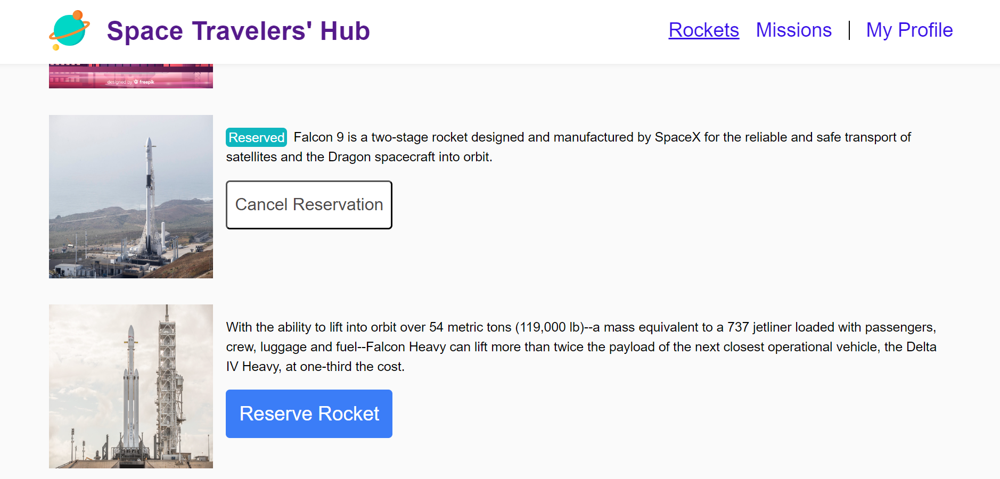
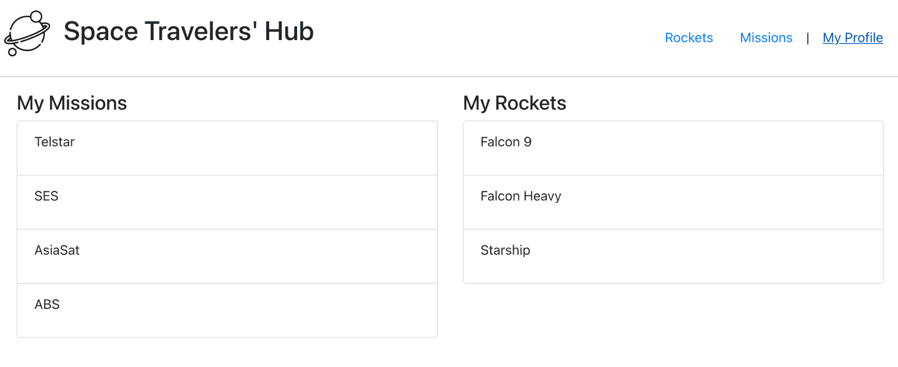

<a name="readme-top"></a>

<div align="center">
 <h3><b>Space-Travelers-Hub </b>.
 </h5>
</div>

<div align="center">
<h3><b>screenshot</b></h3>


</div>

<!-- TABLE OF CONTENTS -->

# 📗 Table of Contents

- [📖 About the Project](#about-project)
  - [🛠 Built With](#built-with)
    - [Tech Stack](#tech-stack)
    - [Key Features](#key-features)
  - [🚀 Live Demo and presentation video](#live-demo)
- [💻 Getting Started](#getting-started)
  - [Setup](#setup)
  - [Prerequisites](#prerequisites)
  - [Install](#install)
  - [Usage](#usage)
  - [Run tests](#run-tests)
  - [Deployment](#triangular_flag_on_post-deployment)
- [👥 Authors](#authors)
- [🔭 Future Features](#future-features)
- [🤝 Contributing](#contributing)
- [⭐️ Show your support](#support)
- [🙏 Acknowledgements](#acknowledgements)
- [📝 License](#license)

<!-- PROJECT DESCRIPTION -->

## 📖 Javascript-Capstone <a name="about-project"></a>

**Space-Travelers-Hub** is a project for learning Gitflows, GitHub workflows, and usage of React, Redux, API and SPA. It has three subpages- Rockets, Missions, and My Profile</b>

<h3> Our team developed a web application called the Space Travelers' Hub, which enables users to book rockets and participate in selected space missions. The application utilizes real-time data from the SpaceX API and features a user-friendly interface that we designed through pair programming.
To ensure the application functions correctly, implemented error handling and thoroughly tested the application to ensure its usability and security.

Overall, the Space Travelers' Hub is a successful web application that meets the needs of our client, a company providing commercial and scientific space travel services. It offers users a seamless booking experience and helps to make space travel accessible to a wider audience. <h3>

## 🛠 Built With <a name="built-with"></a>

## Tech Stack <a name="tech-stack"></a>

<details>
  <summary>Client</summary>
  <b>This project only works client side right now.</b>
  <ul>
    <li>CSS</li>
    <li>JS</li>
    <li>React</li>
    <li>Redux</li>
  </ul>
</details>
<details>
  <summary>Server</summary>
  <ul>
    <li><a href=#>Local Server - Hosted on Github</a></li>
  </ul>
</details>

<details>
<summary>Database</summary>
  <ul>
    <li><a href=#>API's used</a></li>
  </ul>
</details>

<!-- Features -->

# 💻 Key Features <a name="key-features"></a>

## Home page:

- When the page loads, the webapp retrieves data from:
- The selected API and shows the list of items on screen.
- The Involvement API to show the item likes.
- The page should make only 2 requests:
- One to the base API.
- One to the Involvement API.
- When the user clicks on the Like button of an item, the interaction is recorded in the Involvement API and the screen is updated.
- Home page header and navigation similar to the given mockup.
- Home page footer similar to the given mockup.

## Comments popup:

- When the popup loads, the webapp retrieves data from:
- The selected API and shows details about the selected item.
- The Involvement API to show the item comments.
- When the user clicks on the "Comment" button, the data is recorded in the Involvement API and the screen is updated.

<p align="right">(<a href="#readme-top">back to top</a>)</p>

<!-- LIVE DEMO -->

## 🚀 Live Demo <a name="live-demo"></a>

- [Live Demo Link](https://lengushuru.github.io/Space-Travelers-Hub)

<p align="right">(<a href="#readme-top">back to top</a>)</p>

<!-- GETTING STARTED -->

## 💻 Getting Started <a name="getting-started"></a>

To get a local copy up and running, follow these steps.

## Prerequisites <a name="prerequisites"></a>

- In order to run this project you need:

### It would be best if you had some familiarity with `React`, `Redux`, and `JS`.

- A Computer (MAC or PC)
- code editor (VSCode,Atom etc...)
- A browser (Chrome,Mozilla,Safari etc...)
- Version Control System (Git and Github)

# Setup <a name="setup"></a>

Clone this repository to your desired folder:

```bash
       git clone https://github.com/lengushuru/Space-Travelers-Hub.git
       cd Space-Travelers-Hub
```

# Install <a name="install"></a>

Install this project with:

```bash
     npm install
```

# Run tests and check errors <a name="run-tests"></a>

To run tests and check errors, run the following command:

- To Test:-

```bash
   npm test
```

- To check Styelint error:-

```bash
   npx stylelint "\*_/_.{css,scss}"
```

- To check Eslint error:-

```bash
   npx eslint "**/*.{js,jsx}"
```

- To check webhint error:-

```bash
  npx hint .
```

# Deployment <a name="triangular_flag_on_post-deployment"></a>

You can deploy this project using:

```bash
   npm run build
```

<p align="right">(<a href="#readme-top">back to top</a>)</p>

<!-- AUTHORS -->

## 👥 Authors <a name="authors"></a>

## 👤 Abdus Sattar

- GitHub: [AbdusSattar-70](https://github.com/AbdusSattar-70)
- Twitter: [Abdus Sattar](https://twitter.com/Abdus_Sattar70)
- LinkedIn: [Abdus Sattar](https://www.linkedin.com/in/abdus-sattar-a41a26215/)

## 👤 lengushuru charles

- GitHub: [@lengushuru](https://github.com/lengushuru)
- Twitter: [@lengushuru](https://twitter.com/lengush)
- LinkedIn: [charles lengushuru](https://linkedin.com/in/lengushuru)

<p align="right">(<a href="#readme-top">back to top</a>)</p>

<!-- FUTURE FEATURES -->

## 🔭 Future Features <a name="future-features"></a>

- [ ] **Web Responsiveness for all users**
- [ ] **Add web accessibility**
- [ ] **Add Login page**
- [ ] **Add gradient background that will change randomly**

<p align="right">(<a href="#readme-top">back to top</a>)</p>

<!-- CONTRIBUTING -->

## 🤝 Contributing <a name="contributing"></a>

Everybody is welcome to suggest, changes,Contributions, issues, and feature request in this project.

In order to do it, fork this repository, create a new branch and open a Pull Request from your branch.

Feel free to check the [issues page](../../issues/).

<p align="right">(<a href="#readme-top">back to top</a>)</p>

<!-- SUPPORT -->

## ⭐️ Show your support <a name="support"></a>

If you like this project, Please give me ⭐️ and you can use it following [MIT](./LICENSE) license.

<p align="right">(<a href="#readme-top">back to top</a>)</p>

<!-- ACKNOWLEDGEMENTS -->

## 🙏 Acknowledgments <a name="acknowledgements"></a>

Thanks ❤️ to my coding partner <b> @lengushuru</b> for contributing to creating the project.

I would like to thank and appreciate who contributes this project.

<p align="right">(<a href="#readme-top">back to top</a>)</p>

<!-- LICENSE -->

## 📝 License <a name="license"></a>

This project is under [MIT](./LICENSE) licensed.

<p align="right">(<a href="#readme-top">back to top</a>)</p>
